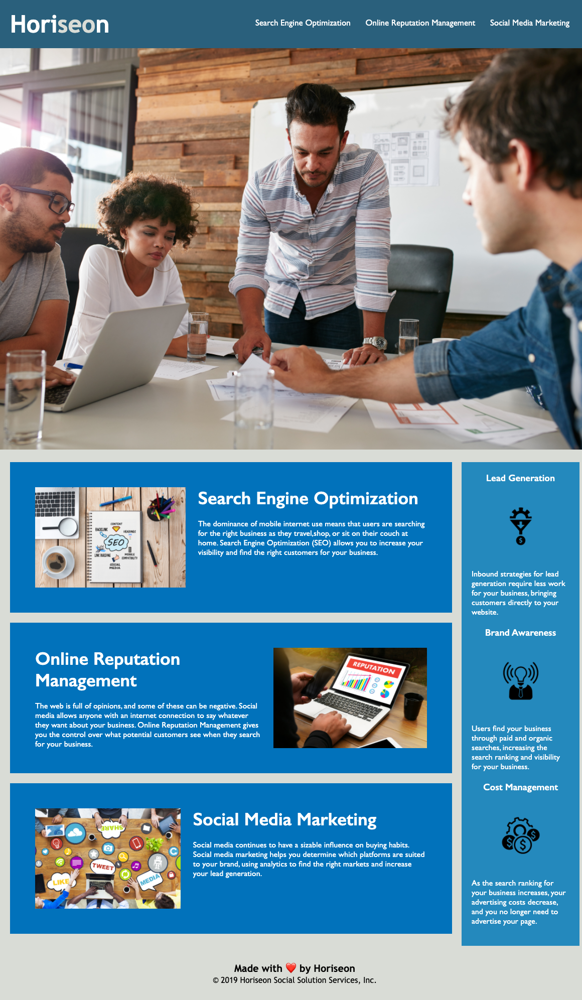

# Refactoring Assignment
## Horiseon Social Solution Services - Refactoring

This is the first assigment for MSU Coding Bootcamp; refactoring existing code to meet the user story acceptance criteria.

### Livepage Link
[Horiseon Social Solution Services](https://danshoup.github.io/horiseon-assignment/)

### Acceptance Criteria Summary
- Use semantic elements in the source code.
- Use a logical structure for elements in the source code independent of styling and positioning.
- Use accessible 'alt' attributes for all image elements.
- Ensure heading attributes fall in sequential order.
- Ensure title element includes a concise, descriptive title.

### Screenshot

### Other Criteria
- Links function correctly.
- CSS is consolidated and organized.
- CSS properly commented.
- Page is deployed at live URL.
- Page loads with no errors.
- GitHub URL submitted.
- GitHub repository contains appropriate code.
- Published page resembles mock-up.
- Repository has a unique name.
- Best practice class/id naming followed.
- Multiple descriptive commit messages used.
- Quality README.md file with a description, screenshot, and link to deployed app.

#### Dan's Notes:
- When I compared the assignment mock-up to my finished version it all looked very similar.  The one thing that bothered me was the weight of the font in `<h2>` and `<h3>` headings in the main content and aside.  While the font matched the mock-up closely, it looked heavier than the mock-up for both headings, and certainly drew my eye to the heavy font. When I changed the weight of the `<h2>` and `<h3>` fonts, it looked more balanced to me, though the text aligned a bit differently than the text in the mock-up.  It seemed more appealing to the eye. 

- The other thing that bothered me, but I didn't change, was the color of the different sections.  It was not part of the criteria, and the finished colors matched the mock-up, but my subjective eye would have preferred to see the header, main, and aside sections match color for more continuity instead of three different shades of blue.